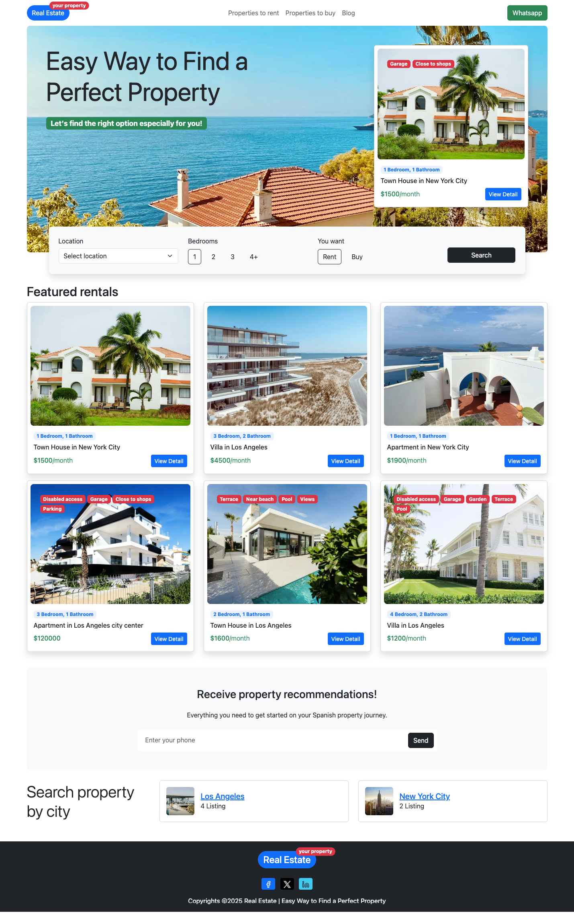
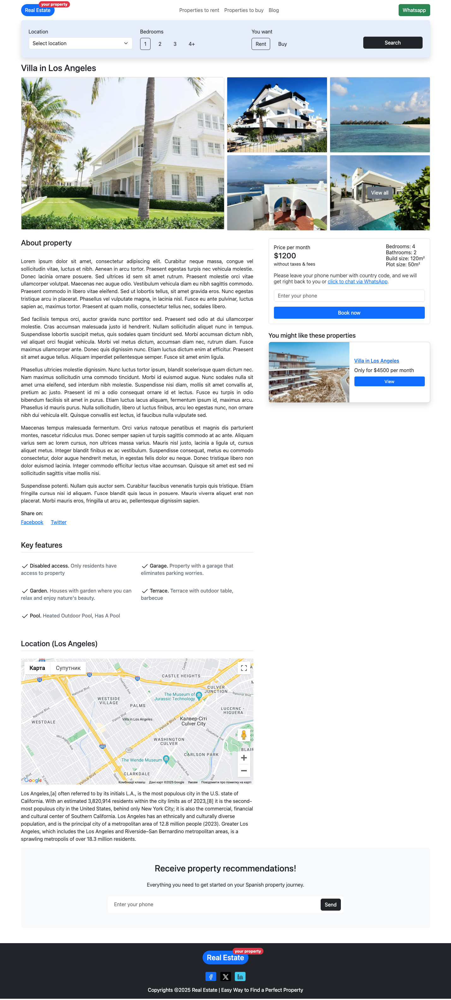
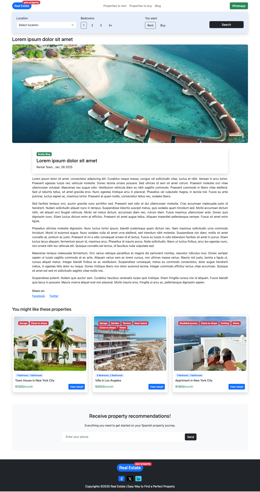

# Realestate profile for Drupal

## What is Realestate?
Realestate is a Drupal 10/11 profile designed to build real estate websites. It's based on the latest frontend technologies, including Bootstrap 5. The maintainer of Realestate is [Vitaly Kindrakevich](https://kindrakevich.com).

* **Demo**: [dist.kindrakevich.com](https://dist.kindrakevich.com)
* **Composer template**: [github.com/kindrakevich-agency/realestate](https://github.com/kindrakevich-agency/realestate)

## What's in this repository?
This repository contains a Drupal profile. When you put it in the `/profiles/contrib/realestate` directory, the Drupal installer gets modified and installs base Realestate theme, some module dependencies, and demo content.

## Installation
1. Put installation profile in the `/profiles/contrib/realestate`.
2. Add dependencies to your main composer.json:
```json
"require": {
    "drupal/address": "^2.0",
    "drupal/admin_toolbar": "^3.4",
    "drupal/default_content": "^2.0@alpha",
    "drupal/field_group": "^3.4",
    "drupal/geolocation": "^3.14",
    "drupal/hal": "^2.0",
    "drupal/pathauto": "^1.13",
    "drupal/svg_image": "^3.0",
    "drupal/twig_tweak": "^3.2",
    "drupal/wpf": "^1.1"
}
```
3. Run in console:
```console
composer update
```
4. Install Drupal from browser.

In case of unexpected problems please update your main composer.json to comply with the latest [Realestate skeleton repository](https://github.com/kindrakevich-agency/realestate).

## After install
Go to ***/admin/config/services/geolocation/google_maps*** and add Google Maps API key.

## Screenshots



